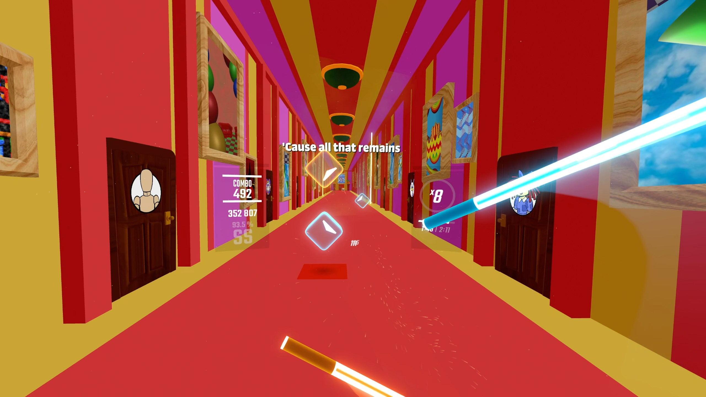

# The One Who's Running the Show - Vivify Beat Saber Custom Map

This is the repository for my map for "The One Who's Running the Show" from The Amazing Digital Circus Episode 8, written and composed by Gooseworx and Dave Capdevielle, and sung by Alex Rochon. This map makes use of the Chroma, Noodle Extensions, and Vivify mods to create a fully custom environment.

BeatSaver link to map: https://beatsaver.com/maps/4fb7e

The mapping, lighting, Vivify environment, and some of the Noodle Extensions animations are all done by [me](https://github.com/Lekrkoekj). Most of the Noodle Extensions animations are made by [Pixy](https://github.com/pixibidi).

Watch an early gameplay preview of the map here (Expert+ difficulty, without Noodle Extensions animations): https://www.youtube.com/watch?v=b_mUvI0htTI

This repository contains all the mapping files, ReMapper script, and full Unity project.

Assets from the following sources are included in this project:
- [Dorm Hall environment by Blue Animations](https://ko-fi.com/s/9dc6925672)
- [VivifyTemplate by Swifter](https://github.com/Swifter1243/VivifyTemplate)
- [UnityAnimationWindow by Swifter](github.com/Swifter1243/UnityAnimationWindow)